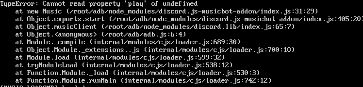

# musicClient

### Parameters

| Parameter | Description | Required |
| :--- | :--- | :--- |
| prefix | set the prefix for music commands | yes |
| youtubeKey | Set youtube api key | yes |

### Requirements

You do not need to worry about opus-script since it is aready included with this package. but however, you will need to install ffmpeg or it will not work

### Example

```text
const dl = require("discord.lib")
dl.musicClient("Music command Prefix", "Youtube Api key")
```

An error code will appear on start up but don't worry, it won't affect the music playlist.



